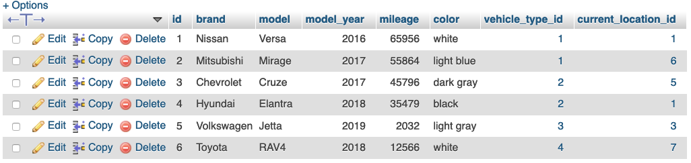
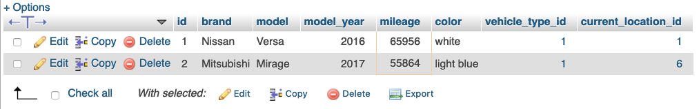
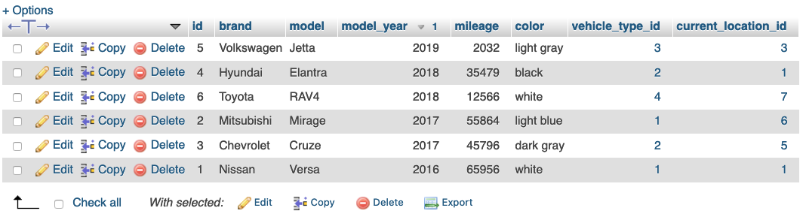
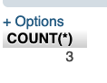

# Assignment 1: `aviano-db` SQL Queries
Write an SQL query that will perform each of the following actions on the `aviano-db` database covered in class. A screencap of the expected results have been provided, where appropriate.

**Important**: Each question should be answered with ONE query.

## Queries
1. Find all vehicles.
    - Expected Output:

      
2. Find all vehicles with a mileage greater than `50000`.
    - Expected Output:

      

3. Find `id`, `model` and `model_year` of all vehicles that are white.
    - Expected Output:

      

4. Find all vehicles, listing them from newest to oldest.
    - Expected Output:

      

5. Using the `COUNT()` function, find the number of vehicles made before 2018.
    - Expected Output:

      

6. Add a new car to `vehicle` with the following infomation:
    - `id`: 7
    - `brand`: Jeep
    - `model`: Compass
    - `model_year`: 2019
    - `mileage`: 10000
    - `color`: Rebecca Purple
    - `vehicle_type_id`: Economy SUV
    - `current_location_id`: Dallas location

7. Update the mileage on the Hyundai Elantra (id is `4`) to `54256`.

8. The company has decided to change the names of their insurance plans. Using the `REPLACE()` function, change all occurances of the word `Cover` to `Insure` so that the insurance plans look like:
    - Insure The Car (LDW)
    - Insure Myself (PAI)
    - Insure My Belongings (PEP)
    - Insure My Liability (ALI)

9. A hobby of the Aviano owners is tax fraud. Delete all rental invoices that have a `total_amount_payable` greater than $3000.

10. Using an `INNER JOIN`, find the `start_date`, `customer_id`,`first_name` and `last_name` of all rentals made by the customer with an email of `khumphris5@xrea.com`.
    - Expected Output:

      

## Marking Rubric
3 points will be given for each SQL query based on the following criteria:
1. Syntax: Does the query run without error? Failure results in a zero for the given question.
2. Accuracy: Did it perform the indended action?
3. Formatting: Was proper case and formatting used?
    - All SQL keywords and function names should be uppercase. Examples:
        - `SELECT`, `INSERT INTO`, `FROM`, `WHERE`, `COUNT()`, etc.
    - New lines and whitespace should be added to make long queries more readable. Example:
        
        ```
        UPDATE
          table
        SET
          key1=value1,
          key2=value2
        WHERE
          field=value
        ```

## Submission Instructions
Paste your answers in a README.md file and submit to Brightspace with the following information:
- Course and Assignment name
- Author
- Make it clear which question each query is answering. 

**DO NOT** upload your answers to a public repo.